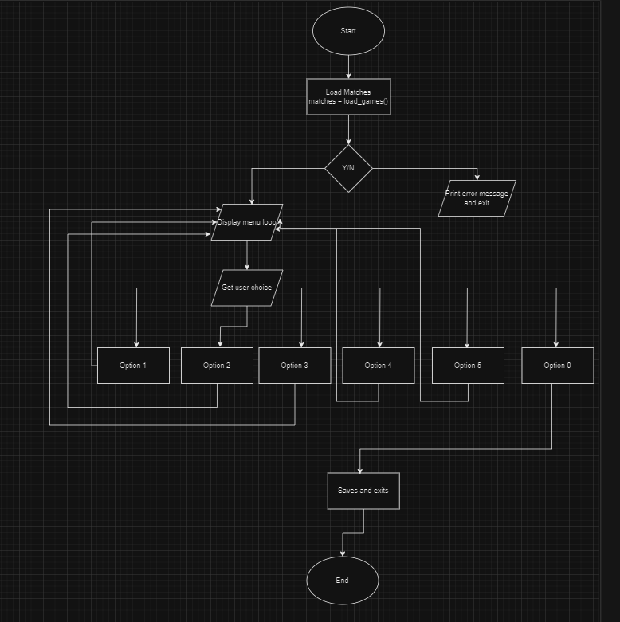
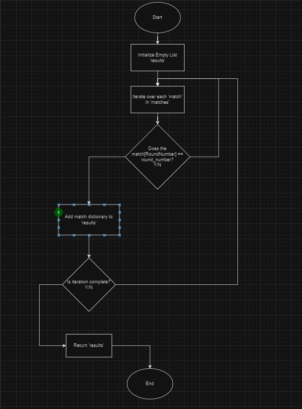
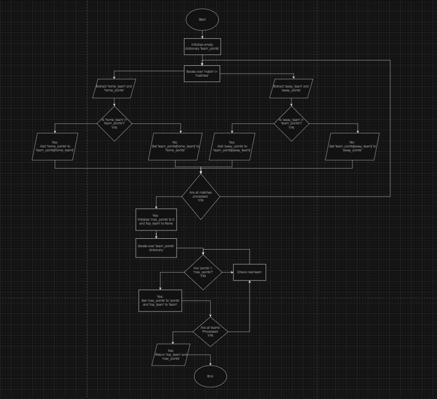
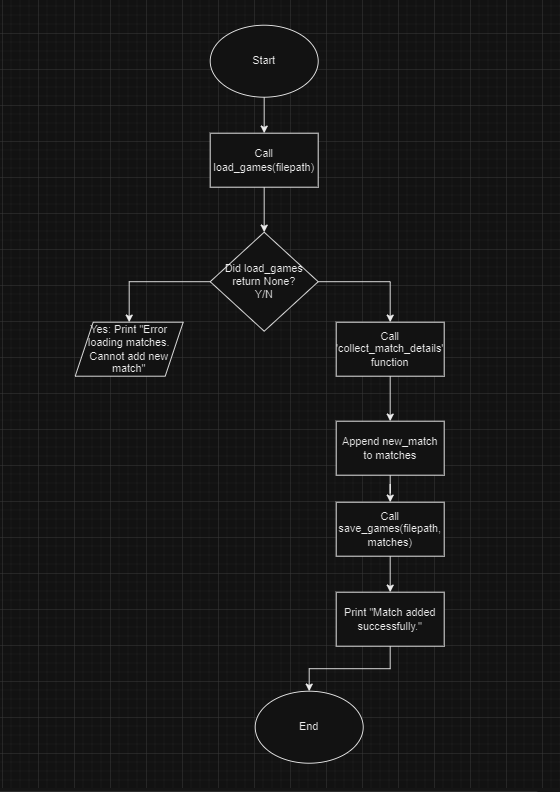
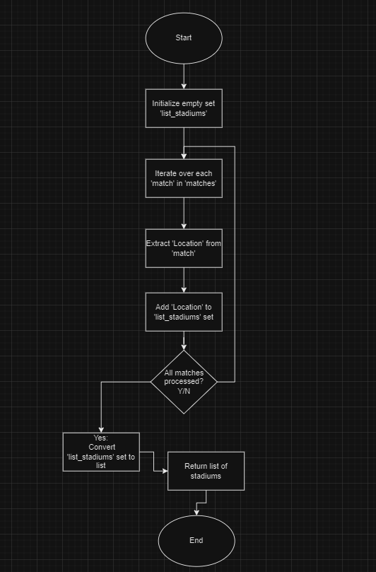
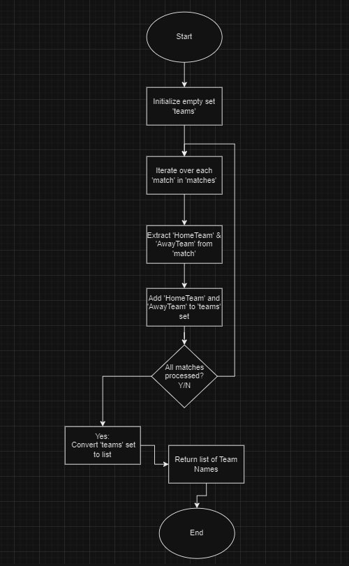
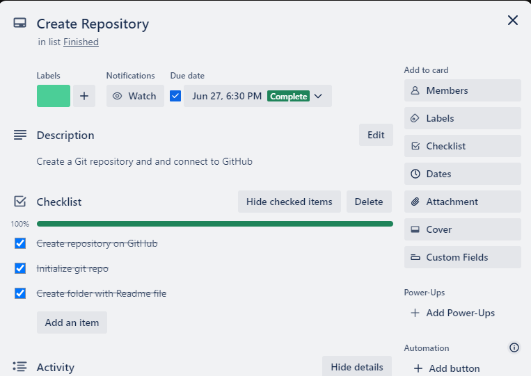
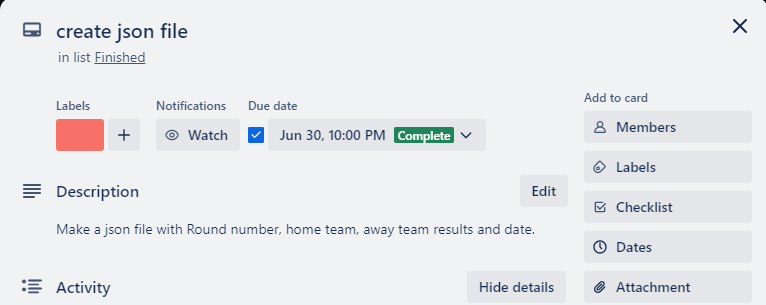
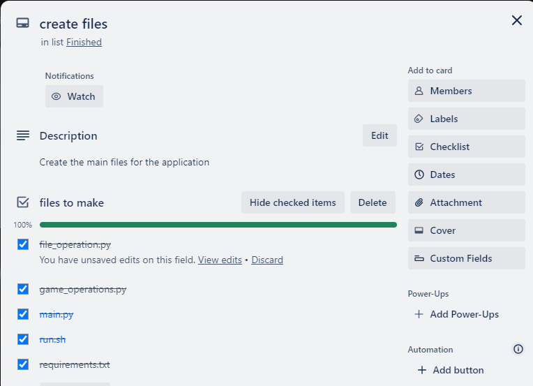
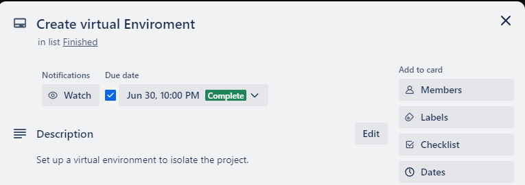

# Rugby League Results Tracker

## Link to GitHub:
* https://github.com/keennathan/Rugby-leaugue-results-T1A3  

## Style Guide or Styling Conventions:
This application adheres to the PEP8 Style guide.  It is used with Python as a set of conventions for writing readable and consistant code.  
* Code Layout:  
    - Uses 4 spaces per indentation level,  
    - Lines are limited to 79 characters,
    - use of docstrings to define a particular function,
    - regular use of commenting,
    - use of naming conventions such as CamelCase for classes and snake_case for functions and variables.
### Reference:
* PEP 8 : Coding Style guide in Python - GeeksforGeeks. (2017, September 11). GeeksforGeeks. https://www.geeksforgeeks.org/pep-8-coding-style-guide-python/

## Overview: 
This application was made to track rugby leaugue results.  The user will be able to look up results from a selected round, add a match, see which team has scored the most points in the season, see the list of stadiums played at, see the list of teams in the competion and save and exit the program. 

## Features: 
### Main Menu:
With this feature the user will be given a list of options choose from.  This will direct them to the different features of the application.
### The logic:
1. Loads the Matches:
    * the function starts by loading game matches from a specific path to the json file.
2. Checks if the matches are loaded:
    * If there are no matches loaded, it will print an error message and exit the function
3. Menu Loop:
    * The function enters the loop to display a menu and get the users choice:  
        * Displays a menu - Shows the user a list of options.  
        * User Input - Gets the users input.  
        * Option 1 Displays games from a round - Prompts the user for a round number and fetches and displays the specific round.  
        * Option 2 Team with the most points - Identifies the team who has scored the most points.  
        * Option 3 Add a new match - Collects details of a new match and adds it to the file.  
        * Option 4 Lists the stadiums - lists and displays the stadiums played at.  
        * Option 5 Lists the teams - Lists the teams that play in the competion.  
        * option 0 Exit - Saves and exits the program.  
        * Invalid selection - It prints an error message if the user doesn't enter a valid selection.  

### Display games from a round:
This function will let the user select a round and will print out the results of all the games in that round.
### The Logic:
1. Input Data:
    * 'matches' - A list of dictonaries where each dictonary represents a match and contains keys such as 'RoundNumber'.
    * 'round_number' - is a number that represents the round number we want to filter to.
2. List Comprehension:
    * Iterate over each dictionary('match') in the list 'matches'.
    * For each 'match', check if the value associated with the key 'RoundNumber' is equal to 'round_number'.
    * If it is True, add the 'match' dictionary to the resulting list.
    * If it is False, exclude the 'match' dictionary from the resulting list.
3. Assigning the results:
    * The resulting list, that contains only the dictionaries that meet the condition, is assigned to the variable 'results'.
4. Return Statement:
    * the 'results' list is then returned.  

### Team with the most points scored:
This function will calculate which team has scored the most points across all the matches in the season.  
### The Logic:
1. Input Data:
    * 'matches' - A list of dictonaries where each dictonary represents a match and contains keys such as 'HomeTeam', 'HomeTeamScore', 'AwayTeam', and 'AwayTeamScore'.  
2. Initialize Dictionary:
    * Initialize an empty dictionary ('team_points') to store the total points scored by each team.  
3. Iterate Over Matches:
    * Loop though each 'match' in 'matches'.  
4. Update the Home Team points:
    * Extract the home team name ('home_team') and its score ('home_points').
    * If the home team is already in 'team_points', add the points to their existing total.
    * If the home team is not in 'team_points', add a new entry with their score.
5. Update the Away Team points:
    * Extract the away team name ('away_team') and its score ('away_points').
    * If the away team is already in 'team_points', add the points to their existing total.
    * If the away team is not in 'team_points', add a new entry with their score.  
6. Find team with most points:
    * Initialize 'max_points' to 0 and 'top_team' to 'None'.
    * Iterate over the 'team_points' dictionary.
    * For each team, if their points are greater than 'max_points', update 'max_points' and 'top_team'.
7. Return Statement:
    * Return the 'top_team' and 'max_points'.  

  
 
### Add a Match:
This feature allows the user to add a match to the json file.
### The Logic:  
1. Input Parameters:
    * 'filepath' is the path to the file that contains the matches.  
    * 'new_match' is the dictionary containing the details of the new match to be add.  
2. Load Existing Matches:
    * The 'load_games' function is called to load existing matches from the file specified by 'filepath'.
    * If 'load_games' returns 'None', it indicates that there is an error with loading the matches and prints an error message and returns without adding the new match.
3. Append New Match:
    * The function 'collect_match_details' is called to collect the details.
    * If the matches are successfully loaded, the new match is appended to the list of existing matches.
4. Save Updated Matches:
    * The updated list of matches is saved back to the file by using the 'save_games' function.
5. Success Message:
    * After successfully saving the updated matches, the function prints a success message.  

  

### List all the stadiums played at:
This feature will show a list of all the stadiums played at in the season.
### The Logic:
1. Input Data:
    * 'matches' is a list of dictionaries where each dictionary represents a match and contains keys such as 'Location'.
2. Extact the stadium locations:
    * Iterate over each match in the 'matches' list and extract the value associated with the 'Location' key.
    * Using a set ensures that only unique locations will be collected because sets do not allow duplicate values.  
3. Convert set to list:
    * The set of unique stadiums is converted to a list using the 'list()' function.
4. Return statement:
    * The function returns a list of unique stadiums.  

### List all the teams:
This feature will show a list of all the teams in the competion.
### The Logic:
1. Input Data:
    * 'matches' is a list of dictionaries where each dictionary represents a match and contains keys such as 'HomeTeam' and AwayTeam'.
2. Extract the Team Names:
    * A set comprehension is used to iterate over each match dictionary in the 'matches' list and extracts the value associated with the 'HomeTeam' and 'AwayTeam'.  
    * using .union joins the sets together and ensures only unique team names are collected.
3. Convert set to list:
    * The set of unique team names is converted to a list using the 'list()' function.  
4. Return statement:
    * The function returns a list of unique team names.

## Implementation Plan: 
Using a Trello board, I divided the work needed into smaller steps and listed them on the cards.  The cards included step by step plan which outlined each feature of the program, checklists, prioritization and time indicators.  
- Trello Board Link  https://trello.com/b/PrNok4BB/python-assignment  

### Setup and Organise Files:  
* Create a directory for the project.
* Create the git repository and link to git hub.
  

* Make the JSON file.  
  

* Create all the files that go in the main directory.  
  

* create the virtual environment.
  

### Main features:

